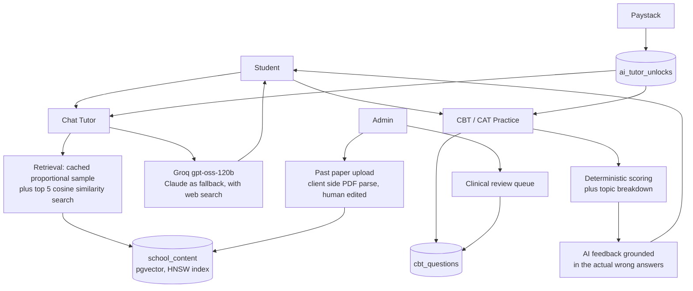

# PassMate

AI exam prep for Nigerian nursing licensure candidates. Live, paid, and in daily use.

**NMCN:** [passmate.ng](https://passmate.ng) · **NCLEX-RN / NCLEX-PN:** [nclex.passmate.ng](https://nclex.passmate.ng)

## What it is, and who it's for

PassMate is an AI tutor and CBT/CAT practice engine for three nursing exams:

- **NMCN**, the licensing exam set by the Nursing and Midwifery Council of Nigeria
- **NCLEX-RN** and **NCLEX-PN**, the US and Canadian registered and practical nursing licensure exams administered by the NCSBN

It is built for candidates who need to study against the actual format and content of their exam rather than generic material: a chat tutor that answers in the context of the exam, timed CBT practice with instant scoring and topic level feedback, and, for NCLEX, an adaptive CAT mode that mirrors how the real exam adjusts difficulty as you answer.

I built it as a registered nurse preparing for these exams myself. I am still the most active user.

## The problem

Nigerian nursing candidates have had two options: textbooks and question dumps that do not match the real exam format and come with no explanations, or expensive US centric prep platforms with no local payment method, no Naira pricing, and no awareness that a Nigerian candidate is often preparing for a local exam and an international one at the same time.

PassMate grounds its tutor in real exam content, runs practice sessions that mirror the real test, and prices in Naira through Paystack.

## Screenshots

<!-- docs/screenshots: dashboard, tutor answering a question, CBT session, session review -->

## Features

- **AI chat tutor** grounded in real exam content for the exam being studied, with conversation memory across sessions
- **CBT mode**: timed, fixed length practice sets with spaced repetition (missed questions resurface sooner, mastered ones fall back) and topic diverse selection
- **CAT mode (NCLEX)**: a real adaptive testing engine. The ability estimate updates after every answer and the session stops when the standard error of measurement crosses a threshold, the same shape as the real exam
- **Post session review**: every completed session opens into a full walkthrough of each question with the correct answer and an AI explanation, and the student can continue into chat to work through exactly the questions they missed
- **Free trial** with server side usage limits, including partner trials for student associations
- **Referral programme** for ambassadors, with commission earned on purchase only

## Architecture

## Tech stack

- **Next.js 16**, React 19, TypeScript, deployed on Vercel
- **Supabase** (Postgres) for application data, with **pgvector** and an HNSW index (cosine distance) for semantic retrieval over exam content
- **Groq** (`gpt-oss-120b`) as the primary chat model, **Anthropic Claude** as fallback with web search and prompt caching on that path
- **OpenAI** `text-embedding-3-small` for embeddings only
- **Redis** for chat rate limiting and unlock status caching
- **Paystack** for payments
- Transactional email via nodemailer

## Key engineering decisions

### Grounding the tutor so it does not make things up

Retrieval is hybrid rather than a single vector lookup. A deterministic proportional sample of the exam's content, sampled evenly across every source so no single document dominates and ordered identically every time so the block can be prompt cached, runs alongside a live top 5 cosine similarity search against the student's actual question. Both are injected into the system prompt on every message.

What the model is allowed to claim differs by exam, and the distinction is enforced, not cosmetic:

- **NMCN** is grounded in uploaded real past papers. Every question drawn from that material is labelled "Real past exam question," and the model is required to say plainly when nothing has been uploaded yet for a topic.
- **NCLEX-RN and NCLEX-PN** have no released past papers, because the NCSBN does not publish them. Practice questions are generated against the NCSBN test plan, presented as NCLEX style questions, and every generated question is stamped `is_ai_generated: true` in the database at write time.

### Session review that is grounded, not generic

Scoring is entirely deterministic: direct comparison against stored correct answers, no model involved. CAT mode runs an IRT style adaptive engine (ability estimate, standard error, stopping rule) on top of that. The one place an LLM enters is the post session feedback, and it is built from that session's real topic breakdown and, when the student continues into chat, the verbatim text of every question they missed. This flow exists because early users asked to review the whole session with the tutor after seeing their score, not just check which questions they got wrong.

## Traction

Figures pulled from the production database, not estimated:

- **55 paying students** (50 NMCN, 2 NCLEX-RN, 3 from an earlier Post-UTME pilot at UI and UCH)
- **238 free trial starts** (190 NMCN, 47 NCLEX-RN, 1 NCLEX-PN)
- **7 Final Prep upgrades**, the NMCN full exam simulation add-on

## Roadmap

What I am building next, and what I applied to build during the Paystack AI Builder Challenge:

- **Adaptive practice for NMCN**: identify each student's weak topics from their attempt history and generate a personalised study plan
- **AI grading of free text rationales**, so students practise clinical reasoning and not just answer recognition
- **Next generation NCLEX item types** (case studies, extended drag and drop) for candidates heading abroad
- **Instrumented trial to paid conversion**, so product decisions run on measured numbers
- Native mobile apps for iOS and Android

## Source

The source is private. A live walkthrough is available on request: okunolaolubanjo@gmail.com or [LinkedIn](https://www.linkedin.com/in/okunolaolubanjo).
